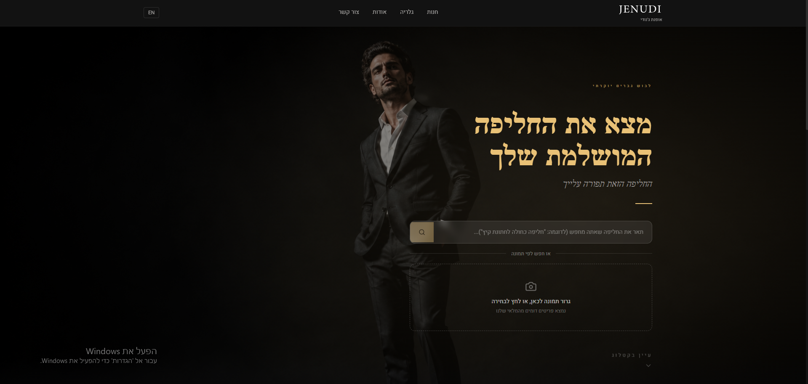
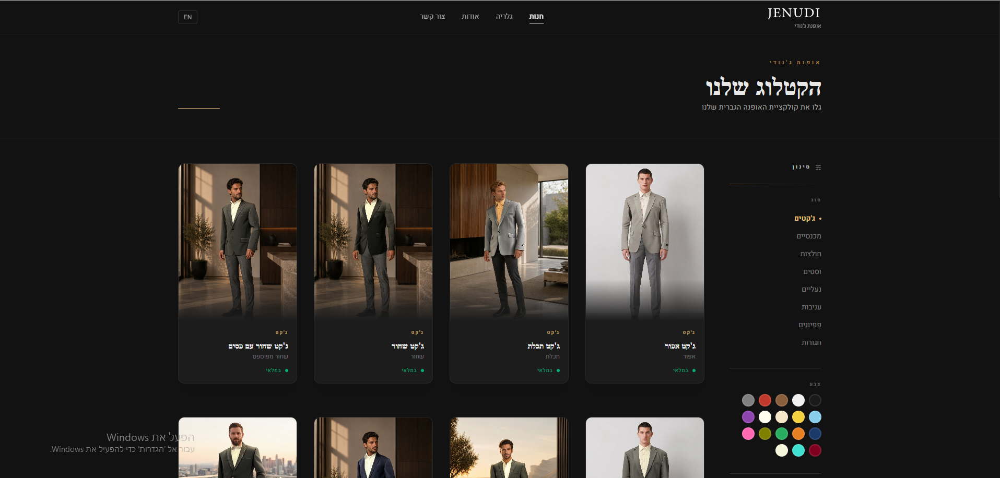
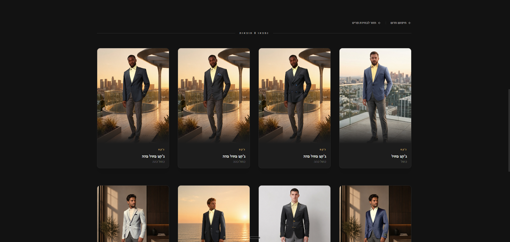
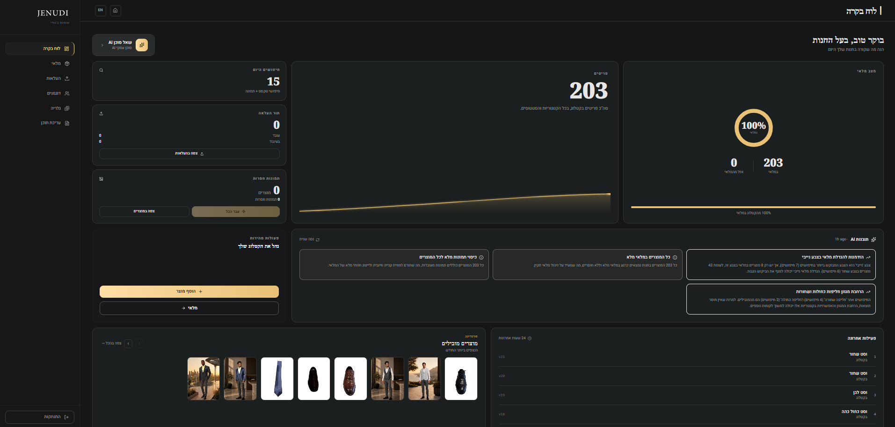

# SeekSuit

SeekSuit is a fashion display website for an existing brick-and-mortar suit store. Customers browse the catalog online and visit the store to try on items. The platform includes AI-powered features: image background removal, hybrid visual+text product search, virtual try-on, and a business insight agent.

> **Architecture document:** see [`Management/Architecture/SeekSuit_Architecture_Document.docx`](Management/Architecture/SeekSuit_Architecture_Document.docx) for a full system design overview.

## Screenshots

| Home & Search | Product Catalog |
|:---:|:---:|
|  |  |

| AI Image Search Results | Admin Dashboard |
|:---:|:---:|
|  |  |

## Tech Stack

| Layer | Technology |
|-------|-----------|
| Frontend | React 19 + Vite 6 + TypeScript + Tailwind CSS 4 |
| Backend | Node.js + Express 5 + TypeScript + Prisma 7 |
| Database | PostgreSQL + pgvector via Supabase (cloud) |
| AI Service | Python 3.11 + FastAPI + BiRefNet + CLIP (ViT-B/32) |
| Auth | Supabase Auth (admin only — no public registration) |
| Runtime | Docker (Backend + AI Service containerized) |
| CI/CD | GitHub Actions + GHCR (Virtual Try-On image builds) |

## Project Structure

```
SeekSuit/
├── Backend/              # Express API server (port 5000)
│   ├── src/
│   │   ├── controllers/  # Route handlers
│   │   ├── services/     # Business logic + AI integration
│   │   ├── routes/       # Express routers
│   │   └── lib/          # Prisma client, LLM providers
│   └── prisma/           # Schema + migrations
├── Frontend/             # React web app (port 5173)
│   └── src/
│       ├── pages/        # Route-level components
│       ├── components/   # Shared UI components
│       ├── services/     # API client functions
│       └── context/      # Auth, language, color context
├── AIService/            # Python microservice (port 8001)
│   ├── main.py           # FastAPI app
│   ├── bg_removal.py     # BiRefNet background removal pipeline
│   ├── image_search.py   # CLIP embeddings + color detection
│   ├── clothing_detector.py  # YOLOS clothing item detection
│   └── finetuned_models/ # Fine-tuned BiRefNet weights (gitignored)
├── RunPod/               # FitDiT VTO serverless deployment (GPU)
│   ├── handler.py        # RunPod entry point
│   ├── Dockerfile        # CUDA image with FitDiT + SAM2
│   └── requirements.txt  # RunPod handler dependencies
├── scripts/              # AI/ML: training notebooks, data prep, VTO tools
├── docs/                 # README screenshots
└── Management/           # Project documentation
    └── Architecture/     # Architecture document + diagrams
```

## Prerequisites

| Tool | Version | Purpose |
|------|---------|---------|
| [Docker Desktop](https://www.docker.com/products/docker-desktop/) | 24+ | Runs Backend + AI Service containers |
| [Node.js](https://nodejs.org/) | 20+ | Frontend dev server + Prisma CLI |
| [Python](https://www.python.org/) | 3.11+ | AI Service (if running outside Docker) |

## First-time Setup

**1. Clone and install frontend dependencies:**
```bash
git clone https://github.com/danieljenudi/SeekSuit.git
cd SeekSuit/Frontend
npm install
```

**2. Configure environment variables:**
```bash
cp .env.example Backend/.env
# Edit Backend/.env and fill in all values (Supabase, Gemini, RunPod, etc.)
```

**3. Apply database migrations:**
```bash
cd Backend
npm install
npx prisma migrate deploy
```

**4. Build Docker images (first time only):**
```bash
.\dev.ps1 --rebuild
```

## Quick Start

All services are managed via a single script from the project root:

```powershell
# Windows
.\dev.ps1

# With rebuild (after code changes to Backend or AIService)
.\dev.ps1 --rebuild
```

```bash
# Linux / Mac
./dev.sh

# With rebuild
./dev.sh --rebuild
```

| Service | URL |
|---------|-----|
| Frontend | http://localhost:5173 |
| Backend API | http://localhost:5000 |
| AI Service | http://localhost:8001 |
| AI Service docs | http://localhost:8001/docs |

> Frontend proxies all `/api/*` requests to the backend automatically.

## API Endpoints

### Products

| Method | Path | Description |
|--------|------|-------------|
| GET | `/api/products` | List products (filters: `type`, `color`, `status`, `search`) |
| GET | `/api/products/:id` | Get single product with images |
| POST | `/api/products` | Create product (admin) |
| PATCH | `/api/products/:id` | Update product (admin) |
| DELETE | `/api/products/:id` | Delete product (admin) |

### Uploads & Images

| Method | Path | Description |
|--------|------|-------------|
| POST | `/api/uploads/raw` | Upload single raw image |
| POST | `/api/uploads/bulk` | Upload multiple images |
| GET | `/api/uploads/unassigned` | List images not yet linked to a product |
| POST | `/api/uploads/assign` | Assign images to a product |
| DELETE | `/api/uploads/image/:imageId` | Delete image |
| PATCH | `/api/uploads/image/:imageId/main` | Set as main image |
| PATCH | `/api/uploads/image/:imageId/unpublish` | Unpublish image |
| PATCH | `/api/uploads/product/:productId/reorder` | Reorder product images |

### Search

| Method | Path | Description |
|--------|------|-------------|
| POST | `/api/search/text` | Text search with Hebrew support + type/color hard filters |
| POST | `/api/search/image` | CLIP image search (multipart image upload) |
| POST | `/api/search/detect` | YOLOS clothing item detection |
| GET | `/api/search/similar/:productId` | Similar products by CLIP embedding |

### AI Insights

| Method | Path | Description |
|--------|------|-------------|
| GET | `/api/insights/stats` | Dashboard stats (inventory, coverage, etc.) |
| GET | `/api/insights/auto` | LLM-generated business insight |
| POST | `/api/insights/chat` | Chat with insight agent |

### Processing Jobs

| Method | Path | Description |
|--------|------|-------------|
| GET | `/api/jobs` | List all processing jobs |
| POST | `/api/jobs/process-all` | Trigger background removal for all pending images |
| POST | `/api/jobs/image/:imageId` | Trigger processing for a single image |
| POST | `/api/jobs/product/:productId` | Trigger processing for all images of a product |

### Virtual Try-On

| Method | Path | Description |
|--------|------|-------------|
| POST | `/api/vto/trigger` | Submit VTO job to RunPod |
| GET | `/api/vto/status/:jobId` | Poll VTO job status |
| GET | `/api/vto/product/:productId` | Get all VTO jobs for a product |
| PATCH | `/api/vto/:jobId/selections` | Update selected try-on results |
| POST | `/api/vto/:jobId/publish` | Publish VTO results to product gallery |
| DELETE | `/api/vto/:jobId/result/:modelKey` | Delete a single try-on result |
| PATCH | `/api/vto/image/:imageId/front-view` | Set image as front view for VTO |

### VTO Models

| Method | Path | Description |
|--------|------|-------------|
| GET | `/api/vto-models` | List all virtual model folders |
| POST | `/api/vto-models/:folderName/photos` | Upload photo for a model |
| DELETE | `/api/vto-models/:folderName/photos/:filename` | Delete model photo |
| DELETE | `/api/vto-models/:folderName` | Delete model folder |
| PATCH | `/api/vto-models/:folderName/rename` | Rename model folder |

### Analytics

| Method | Path | Description |
|--------|------|-------------|
| POST | `/api/analytics/view` | Record a product page view |
| GET | `/api/analytics/searches` | Search history (admin) |
| GET | `/api/analytics/top-products` | Top viewed products (admin) |

### Colors

| Method | Path | Description |
|--------|------|-------------|
| GET | `/api/colors` | Get all color options |
| POST | `/api/colors` | Create color (admin) |

### Gallery

| Method | Path | Description |
|--------|------|-------------|
| GET | `/api/gallery` | Get public gallery images |
| POST | `/api/gallery/upload` | Upload gallery image (admin) |
| POST | `/api/gallery/upload-bulk` | Bulk upload gallery images (admin) |
| PUT | `/api/gallery/reorder` | Reorder gallery (admin) |
| DELETE | `/api/gallery/:id` | Delete gallery image (admin) |

### Content

| Method | Path | Description |
|--------|------|-------------|
| GET | `/api/content` | Get site content (about text, images, etc.) |
| PUT | `/api/content` | Update content (admin) |
| POST | `/api/content/seed` | Seed default content (admin) |
| POST | `/api/content/upload-image` | Upload site image asset (admin) |
| DELETE | `/api/content/:key` | Delete content entry (admin) |

### Contact

| Method | Path | Description |
|--------|------|-------------|
| POST | `/api/contact` | Send contact email |

> Authentication is handled client-side via Supabase Auth SDK. Admin routes require a valid Supabase session cookie validated by the `requireAdmin` middleware.

## Frontend Routes

| Path | Page | Access |
|------|------|--------|
| `/` | Home — image/text search + featured products | Public |
| `/shop` | Full product catalog with filters | Public |
| `/products/:id` | Product detail + image gallery + VTO results | Public |
| `/about` | About the store | Public |
| `/contact` | Contact form | Public |
| `/gallery` | Store gallery | Public |
| `/admin/login` | Admin login | Public |
| `/admin` | Dashboard — stats + AI insight agent | Admin |
| `/admin/inventory` | Product list + CRUD | Admin |
| `/admin/inventory/new` | Create new product | Admin |
| `/admin/inventory/:id/edit` | Edit product | Admin |
| `/admin/uploads` | Bulk image upload queue + AI processing | Admin |
| `/admin/vto-models` | Virtual try-on model management | Admin |
| `/admin/gallery` | Gallery management | Admin |
| `/admin/content` | Site content editor | Admin |

## Database Schema

### Product
| Field | Type | Notes |
|-------|------|-------|
| id | string | CUID |
| name | string | Display name |
| sku | string | Unique product code |
| type | enum | `JACKET` `PANTS` `SHIRT` `VEST` `SHOES` `TIE` `BOW_TIE` `BELT` |
| color | string | |
| status | enum | `IN_STOCK` `OUT_OF_STOCK` |
| attributes | JSON? | Type-specific metadata (material, fit, etc.) |

### ProductImage
| Field | Type | Notes |
|-------|------|-------|
| id | string | |
| productId | string? | Nullable — images can be unassigned |
| rawUrl | string | Supabase `raw-images` bucket |
| processedUrl | string? | Supabase `processed-images` bucket (post-AI) |
| isMain | bool | Primary display image |
| order | int | Display order within product |
| embedding | vector(512)? | CLIP embedding for image search |
| dominantColor | string? | Extracted dominant color hex |

### ProcessingJob
Tracks background-removal jobs: `PENDING → PROCESSING → DONE / FAILED`.

> No price, quantity, or size fields — customers visit the store to try on items.

## AI Features

### Background Removal
BiRefNet model removes backgrounds from raw product photos and applies canvas normalization: auto-crop, 8% padding, 1200×1600 portrait canvas, white background.

### Hybrid Image Search
Upload a photo or crop a garment — CLIP (ViT-B/32) encodes the image and queries pgvector for cosine similarity against all product embeddings. When multiple garments are detected via YOLOS (fine-tuned on Fashionpedia), the user picks a specific item before searching. Results are filtered by garment type and sorted by similarity.

### Text Search (Hebrew + English)
Full-text search with synonym expansion and hard filters for product type (Hebrew grammatical variants supported) and color.

### Virtual Try-On
FitDiT model (via RunPod serverless GPU) composites a selected garment onto a model photo. SAM2 generates garment segmentation masks for vests. Admin interface assigns garments to model images and manages the try-on gallery.

### Business Insight Agent
LLM agent reads live inventory data and generates natural-language business insights on the admin dashboard (stock gaps, popular types, catalog coverage, etc.).

## Progress

- [x] Backend CRUD API
- [x] Frontend foundation (Vite + React + routing + API client)
- [x] Core UI pages (catalog, product detail, admin forms, design system)
- [x] Admin authentication (Supabase Auth + JWT)
- [x] AI image processing pipeline (upload → BiRefNet → canvas normalization)
- [x] Hybrid image search (CLIP + pgvector)
- [x] Text search (Hebrew/English + type + color filtering)
- [x] Virtual try-on admin UX (FitDiT on RunPod)
- [x] Business insight agent (LLM on admin dashboard)
- [x] Testing & QA
- [ ] Production deploy — planned in coordination with store owner after academic submission
